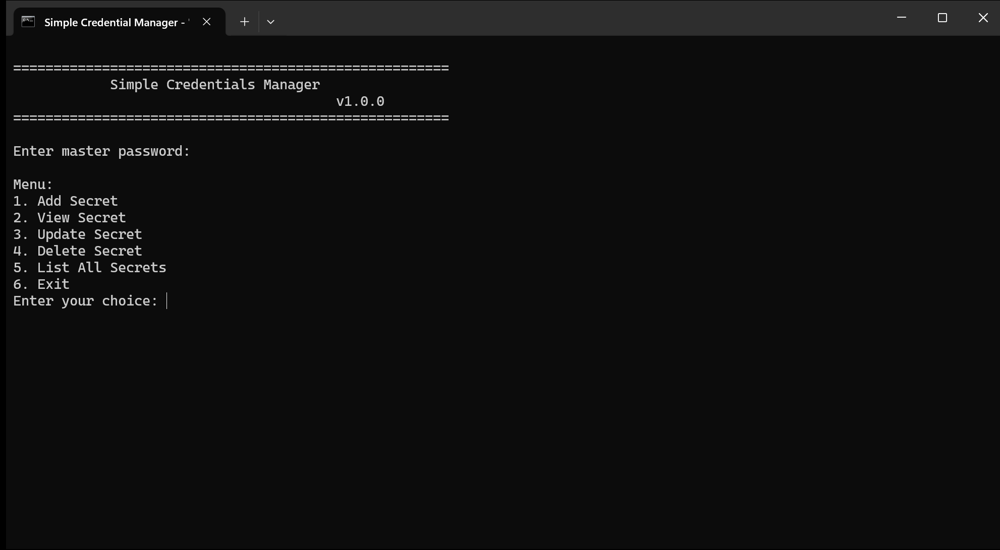
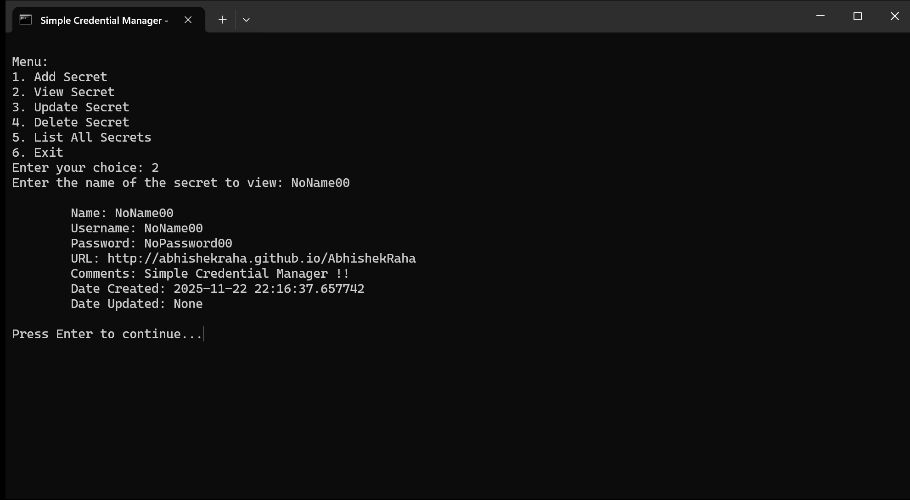

Simple Credential Manager
=========================

A minimal, local, file-backed credential manager written in Python.
It stores encrypted secrets (name, username, password, URL, comments) on the local machine and protects them with a
master password.

Change Log
---------------

See [CHANGELOG.md](CHANGELOG.md) for the full release history.

Release Packaging
-----------------

After a successful merge to `main` and a passing GitHub Actions test run, the repository automatically creates a GitHub
release named `SimpleCredentialManager.v<version number>`.

That release uses GitHub's built-in source archive generation, so the repository ZIP is made available automatically
from the release tag without maintaining a separate packaging script.

`v2.0.3`

- automatically locks the desktop UI and authenticated CLI sessions after 1 minute of inactivity

Important Disclaimer
--------------------

This project is a hobby project and may contain bugs, design flaws, or incomplete features. Do not use it unless you
have reviewed the code, understood how it stores and protects data, and accepted the risks of a local file-backed
password store.

Security Warning
----------------

All secrets, metadata, exports, and audit artifacts are stored on the local machine. If an attacker can copy the vault
files from the machine, they can attempt offline brute-force attacks against the master password. The application adds
encryption, lockout/backoff, and audit logging, but it does not make a compromised machine safe.

Use this software only if you understand:

- the master password is the main security boundary
- local plaintext exports are especially sensitive
- anyone with sufficient access to the machine or copied vault files can still attempt brute-force recovery offline
- losing the master password means the encrypted secrets cannot be recovered

Do not treat this project as production-grade security software unless you have independently reviewed and validated the
implementation for your own use case.

Features & Functionality
------------------------

1) First initialization
    - On the first run the desktop app or CLI performs an interactive setup and prompts you to create and confirm a
      master password. This prepares the application for secure use.

2) Master password (critical)
    - The master password is the single, critical key for the vault. All stored secrets are encrypted and require this
      password to access. If you lose the master password the application cannot recover the secrets.

3) Authentication backoff & audit logging
    - The application tracks failed master-password attempts.
    - Repeated failures trigger a temporary lockout with increasing backoff instead of deleting the vault.
    - Authentication, vault, and credential-management actions are written to a local audit log.
    - The audit log records action metadata, but not plaintext secret values or passwords.

4) Local storage
    - All data (metadata and encrypted secrets) is stored on the user's local machine. No cloud storage is used by
      default.

5) Vault format
    - New vaults use the current `v4` key-derivation and metadata format.
    - Legacy `v2` and `v3` vault logic has been removed from the codebase.
    - This release supports only `v4` vault metadata and key derivation.
    - If you still encounter a `v2` or `v3` vault on a machine that was expected to be migrated already, report it as
      a bug at
      `https://github.com/abhishekraha/SimpleCredentialManager`.

6) Desktop UI
    - `v2.0.0` introduced a native Tkinter desktop interface that works with the same encrypted vault used by the CLI.
    - The UI supports unlock/setup, add/view/edit/delete, search, clipboard copy, import/export, and lock.
    - In the details view, clicking the username copies it to the clipboard and clicking the password copies the password.
    - Clicking the stored URL opens it in the default browser.
    - `v2.0.1` adds bulk insert with a header-guided comma-separated input dialog.
    - `v2.0.2` adds click-to-copy for usernames and click-to-open behavior for stored URLs.
    - `v2.0.3` automatically locks the desktop UI and authenticated CLI sessions after 1 minute of inactivity.
    - Both the UI and CLI use the same backend service, so storage and security behavior live in one place.

7) CLI menu options
    - Add Secret: interactively add a new secret.
    - Bulk Insert Secrets: paste comma-separated rows into the CLI using the displayed header format.
    - View Secret: view details for a stored secret (requires master password).
    - Update Secret: modify an existing secret.
    - Delete Secret: remove a secret from the store.
    - List All Secrets: display a list of stored secret names.
    - Export to CSV: export stored entries to a CSV file (to a default app location by default); prompts before
      overwriting an existing file and allows you to choose a different name/location.
    - Import from CSV: import entries from a CSV file; prompts before overwriting existing entries or files and lets you
      select the import file.
    - Exit: quit the CLI.

Installation
------------
Prerequisites:

- Python 3.8+ (Python 3.11+ tested by project artefacts)
- pip
- Tkinter support for the desktop UI
  - On Linux this may require installing a distro package such as `python3-tk`.

Install dependencies:

Windows PowerShell:

    python -m pip install --upgrade pip; python -m pip install -r requirements.txt

Or use the provided Windows launcher `SimpleCredentialManagerCli.bat` which attempts to find Python and install
requirements automatically.

Usage
-----

1. Start the desktop UI directly:

   python SimpleCredentialManagerUi.py

2. Or use the OS-specific UI launcher scripts:

- Windows: run `SimpleCredentialManagerUi.bat`
- POSIX: run `./SimpleCredentialManagerUi.sh`

3. The CLI remains available if you prefer a terminal workflow:

   python SimpleCredentialManagerCli.py

4. CLI launchers are also still available:

- Windows: run `SimpleCredentialManagerCli.bat` (this will open the CLI in a new Command Prompt window)
- POSIX: run `./SimpleCredentialManagerCli.sh`

The desktop UI and CLI both talk to the same backend service and the same local vault files.

On first run:

- You'll be prompted to create a master password and re-enter it. The app will create the metadata and secrets files on
  your local machine.
- Keep the master password safe. If you lose it, the application cannot recover the secrets (they are encrypted with a
  key derived from the password).

If you already have an older vault:

- This release no longer supports `v2` or `v3` vault logic.
- If a machine was expected to be migrated already but still shows an older vault format, report it as a bug at
  `https://github.com/abhishekraha/SimpleCredentialManager`.

Container (optional Docker environment)
--------------------------------------

- The `container/` directory contains a Dockerfile that builds an Ubuntu-based image with the dependencies needed to run
  the CLI in an isolated environment. This is useful to test the project in a disposable environment before running it
  on your local machine.
- Important: by default the container does not map any host directories or volumes. Any data (secrets or metadata)
  created inside the container will be lost when the container stops or you log out, unless you explicitly mount a host
  directory or Docker volume for persistence.

To build and run the container:

    cd container
    docker build -t simple-credential-manager .
    docker run -it --rm simple-credential-manager

License
-------
This project includes a LICENSE file at the repository root. Check it for licensing details.

Contact
-------
For questions or contributions, open an issue or a pull request against the repository.
